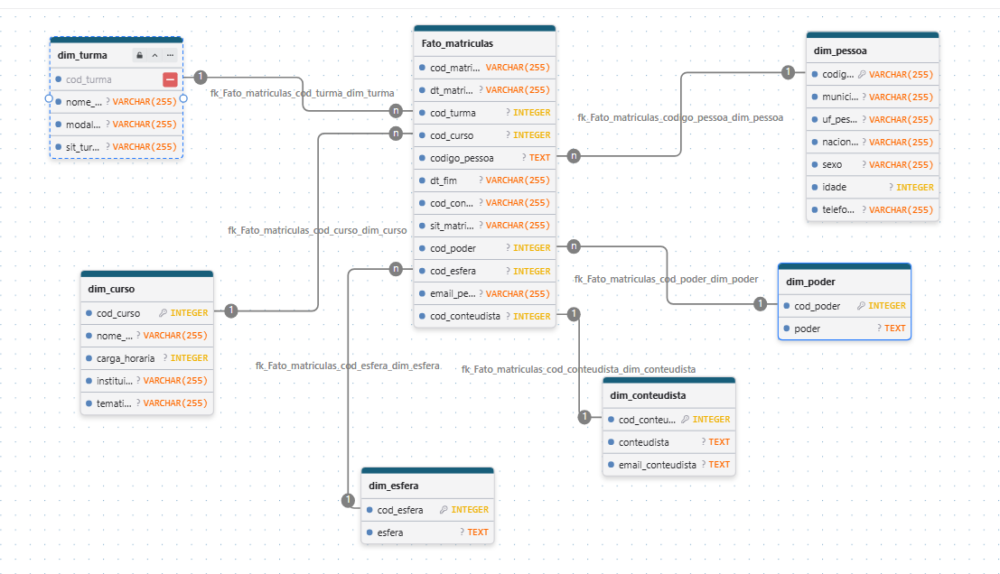

# Análise de Desempenho e Matrículas - Escola Virtual de Governo (EVG)

Este repositório contém o projeto de Business Intelligence desenvolvido a partir da base de dados amostral da Escola Virtual de Governo (EVG). O objetivo principal é consolidar, modelar e visualizar dados de matrículas, perfis de alunos, cursos e modalidades para apoiar a tomada de decisão no setor público.

---

## 1. Arquitetura do Modelo de Dados (Star Schema)

A modelagem de dados foi estruturada no modelo dimensional **Star Schema** (Esquema em Estrela). A limpeza e a remoção de duplicidades nas chaves primárias foram executadas no Power Query para garantir a integridade referencial e o relacionamento correto do tipo **`*:1`** (Muitos para um) com direção de filtro única a partir da tabela fato.

### Estrutura das Tabelas

- **Tabela Fato (`f_amostra_evg`)**: Registros de transações de matrículas, códigos identificadores e status das conclusões.
- **Tabelas de Dimensão**:
  - `dim_curso`: Atributos dos cursos (`cod_curso`, `nome_curso`, `tematica`, `instituicao`, `carga_horaria`).
  - `dim_turma`: Detalhes das turmas (`cod_turma`, `nome_turma`, `modalidade_turma`).
  - `dim_pessoa`: Dados demográficos dos alunos (`codigo_pessoa`, `sexo`, `idade`, `municipio_pessoa`, `uf_pessoa`).
  - `dim_poder`: Classificação por poder de atuação (`id_poder`, `poder`).
  - `dim_esfera`: Classificação por esfera administrativa (`id_esfera`, `esfera`).
  - `dim_conteudista`: Informações sobre os órgãos provedores de conteúdo (`id_conteudista`, `conteudista`).
  - `dim_calendario`: Tabela temporal gerada via DAX para suportar inteligência de tempo (conectada em `dt_matricula`).

### Diagrama do Modelo Relacional



---

## 2. Métricas e Regras de Negócio (DAX)

Todas as medidas analíticas foram organizadas em uma tabela exclusiva (`_Medidas`) para facilitar a governança e reutilização no relatório.

### Total de Matrículas
Calcula o volume absoluto de inscrições efetuadas na plataforma no período selecionado.
```dax
Total Matrículas = COUNTROWS(f_amostra_evg)

---

### Perguntas de Negócio 
Análise de Negócio e Questões Estratégicas
Abaixo estão registradas as questões analíticas do projeto e as respostas extraídas a partir da navegação no Dashboard Power BI:

Q1. Qual o volume total de matrículas e de conclusões registradas na plataforma?
Objetivo: Avaliar o alcance geral e o nível de engajamento dos alunos na EVG.

Resposta:

Total de Matrículas: 188 mil matíriculas.

Matrículas Concluídas: 92 mil matrículas concluídas.

Taxa de Conclusão Global (%): 0,49 ou 49% de conclusão.

Q2. Quais temáticas de cursos possuem maior volume de inscrições e qual apresenta a melhor taxa de conclusão?
Objetivo: Identificar os temas com maior demanda e as áreas com melhor desempenho acadêmico.

Resposta:

Temática com Mais Inscrições: Direitos Humanos e Cidadania.

Temática com Maior % de Conclusão: Gestão de Formação e do Conhecimento

Temática com Menor % de Conclusão: Transferência Voluntária.

Q3. Como se comporta a evolução temporal das matrículas ao longo dos meses e anos?
Objetivo: Identificar sazonalidade, meses de pico e tendências de crescimento nas inscrições.

Resposta:

Ano/Mês de Maior Pico: Janeiro de 2025.

Comportamento Geral: Os mêses de pico são no início do ano e decaem de acordo com o passar do tempo com um breve aumento nos meses de junho e agosto.

Q4. Qual é a distribuição dos alunos por Esfera Administrativa e Poder de atuação?
Objetivo: Entender qual segmento do setor público utiliza mais a plataforma.

Resposta:

Esfera com Maior Participação: Estadual com 34 mil matrículas totais.

Poder com Maior Participação: Municipal com 28 mil matrículas totais.

Q5. A modalidade da turma influencia a taxa de término dos cursos?
Objetivo: Comparar o desempenho dos alunos entre diferentes modalidades de turmas.

Resposta:

Modalidade com Maior Taxa de Conclusão: Elas são iguais.

Observação Analítica: Observandos as modalidades da turma, elas são iguais independente da modalidade.
